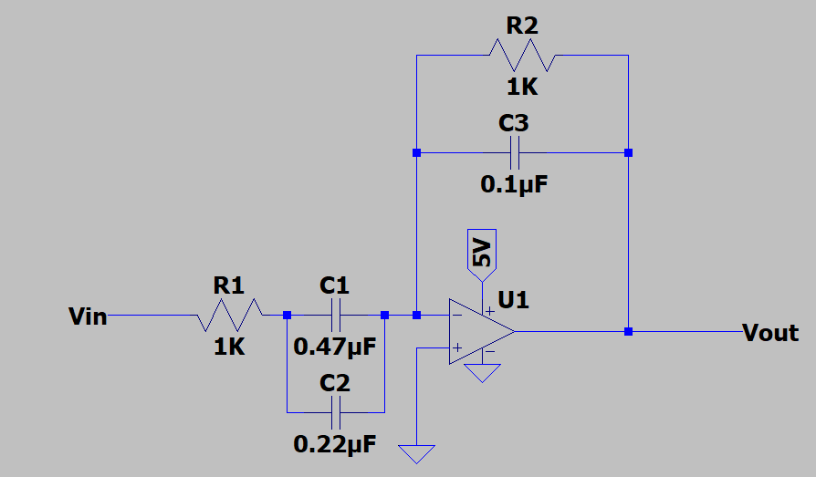
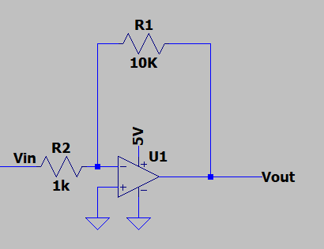
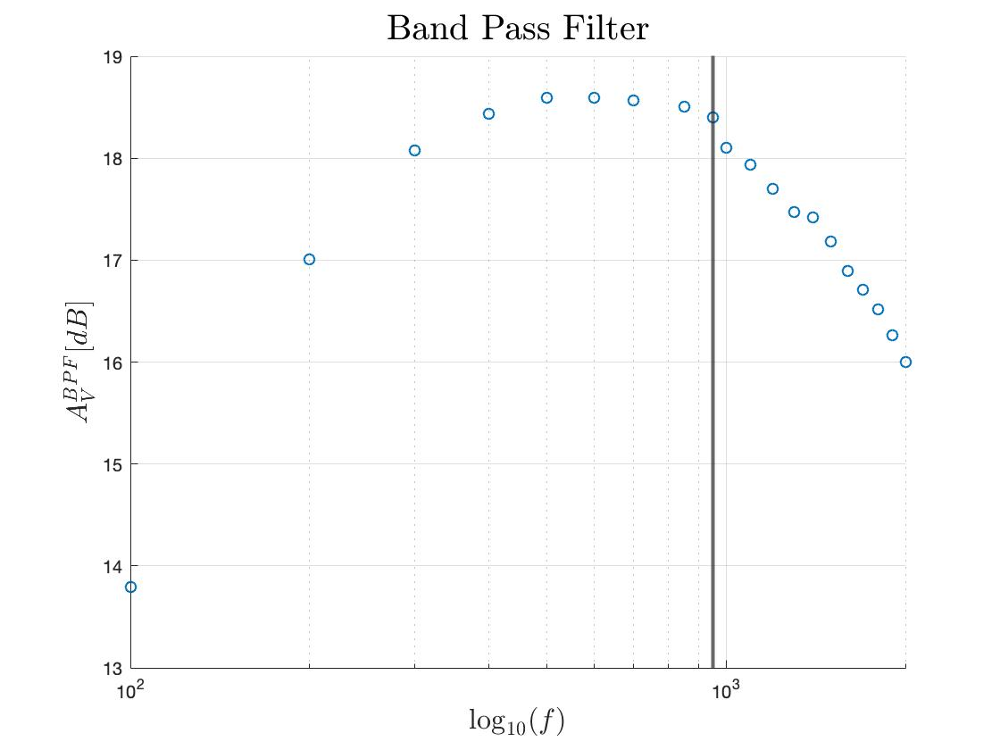

# Lab 2
## Monday 09/16/2019

*** FFT on the Arduino***

In this lab we implemented a Fast-Fourier-Transform (FFT) to identify a specific tone that is to eventually be generated as a start tone at competition. This was done by using the Arduino FFT Library, polling an analog audio sensor, along with multiple filters, both digital and analog.

To get the microphone working, we first started with the stock schematic that was provided to us on the lab 2 website. This schematic is shown below. With the microphone wired to analog pin A0, we were then able to use the FFT library from Arduino to get the Fast-Fourier Transform of the audio. This code is parsed below.

```cpp
ADCSRA = 0xE5; //Turns the ADC on in free running mode (i.e latches only when we tell it to take a sample)
ADMUX  = 0x40; //Sets the source to ADC0 (hard wired to pin A0)
DIDR0  = 0x01; //Turns off the digital input (on by default) on pin A0
```

It is worth taking a look at the ADC status register, ADCSRA, and noting that the prescale bits, ADCSRA[0:2], are being set to 3b'101. This sets the clock division factor of the ADC at 32, meaning that the ADC internal clock will run at 16Mhz /32 = 500Khz. This paired with the 13 cycles that the successive approximation ADC takes to convert a value means that the maximum polling frequency is actually at 500Mhz / 13 = 34.5Khz or 26 microseconds between sample. This will become important later on when we are trying to decifer the output of the FFT.

We then enter our next code block from the example code, which uses a for loop to take 256 samples in sucession to generate an array suitable for an FFT. This is done by waiting for the ADC to finish the conversion, renabling the ADC, and while we are waiting for the ADC to finish polling we add the element to the fft_input array.

```cpp
for (int i = 0; i < 512; i += 2) {
   while(!(ADCSRA & 0x10)); // wait for adc to be ready
   ADCSRA = 0xf5; // restart adc
   byte m = ADCL; // fetch adc data
   byte j = ADCH;
   int k = (j << 8) | m; // form into an int
   k -= 0x0200; // form into a signed int
   k <<= 6; // form into a 16b signed int
   fft_input[i] = k; // put real data into even bins
   fft_input[i+1] = 0; // set odd bins to 0
}
```

Since we start the ADC conversion at the beggining of the while loop, we can use precious CPU time to get the previous sample value and put it into the fft_input array before the next sample is done. This allows us to keep our sample rate extremely close to 34.5Khz. This sample rate is important in determining where exactly the 950Hz frequency is.

The output of the FFT function is an array called fft_log_out[i], this is an array of length 128 (since we have 256 samples). To find the frequency of importance, 950Hz, we have to calculate the closet "bin" to it. Since this is a fast fourier transform, each of the frequencies get lumped into #samples/2 groups whose harmonic frequency can be found by the formula f = n * (Sample Rate / # of Samples). If we solve for n with Sample Rate = 34.5Khz, Samples = 256, and f = 950Hz, we get that n = 6.88. This means that we are going to be looking for a spike in bin 7, as this is where the majority of the magnitude from 950Hz will show up. Below is the section of code that we used to identify if there was a 950Hz tone being played, and if so, make the LED tied to pin 13 light up.

```cpp
if (fft_log_out[7] - fft_log_out[6] > 20 && fft_log_out[7] - fft_log_out[8] > 20) {
  digitalWrite(13, HIGH);
}
```

We ended up using a double comparison for the fft magnitude so as to rule out outside noise that may or may not be present. The threshold of 20dB was decided through testing the microphone with different tones and seeing how the fft plot reacted. Below are some of the serial plots that we recored while doing this lab.

<p align="center">
   
   <br>
   <a>No tone being played</a>
</p>

<p align="center">
   
   <br>
   <a>Tone being played</a>
</p>

As you can see in the second image of the FFT, there is a very distinct peak right after the harmonic frequency. This is the spike for 950Hz being played. It appears so close to the fundemental because n = 7 where n can range from 0 to 128.

***Filtering out the Noise***

For our filtering circuitry, we decided to go with an active band pass filter. This filter consists of two main elements, a high pass filter on the input, and a low pass filter on the output. The schematic is shown below. This circuit is what we are using for two of the three circuitry components in lab, the op amp circuit and our RC filter. Our third circuit was a Inverting amplifier to reinvert the signal and to add a gain of +20dB. We were able to use the inverting amplifier configuration for the band pass filter as we put a DC bias on the speak. By adding a resistor divider on the speaker ground port that divided Vdd (5V) by 2, we were able to make the amplifiers radiometric about 2.5V.

For the bandpass circuit, we placed placed a series RC combination on the inverting input of the op amp and a parallel RC combination on the feedback loop of the op amp. The series combination gave us the high pass filter and the parallel combination gave us the low pass filter. Cascading high pass and low pass together creates a bandpass filter. We designed the op amp to only accept frequencies between the range of 150 Hz and 1.5 kHz. To do this, we used Equation 1.1. Rearranging Equation 1.1 gave us equation 1.2. Using these equations at fB = 150 and fB = 1.5 kHz, respectively, we get that C1 = .7uF and C2 = .1uF. 

Equation 1.1: fB = (1/(2 * pi * R * C ))
Equation 1.2: C = (1/(2* fB * pi * R ))

Using the Node-Voltage Method for Circuit Analysis, we determined that the transfer function of the Bandpass Filter is stated in Equation 1.3. After designing, creating, and testing the active bandpass filter, we cascaded the output of the bandpass filter into an inverting op amp configuration.

Equation 1.3: H1(jw) = (-j * w * R2 * C1 )/ ((1+j * w * R1 * C1 ) + (1 + j * w * R2 * C2)). 

For the inverting op amp, we placed R1 on the inverting input terminal and R2 on the feedback loop. We wanted an absolute value gain of 10, so R2 = 10 kOhms and R1 = 1kOhm. The transfer function of the inverting op amp is shown in Equation 1.4. By cascading the two op amp circuits, we multiply the transfer functions of the two circuits, obtaining an overall transfer function equation shown in Equations 1.5 and 1.6. Equation 1.6 is a band pass filter with a mid bandpass region gain of 10 ( roughly 20 dB).

Equation 1.4: Av2 = -(R2/R1)
Equation 1.5: H(jw) = Av2 * H1(jw)
Equation 1.6: H(jw) = ((R2/R1) * (j * w * R2 * C1)) / ((1 + j * w * R1 * C1 ) + (1 + j * w * R2 * C2 ))


<p align="center">
   
   <br>
   <a>Schematic of the Band pass filter</a>
</p>


<p align="center">
   
   <br>
   <a>Schematic of the Inverting Op Amp</a>
</p>

Below is the Bode plot for the cascaded filter. It has almost the gain that we desired, of course things in real life wont work out quite as nicely as on paper. The vertical line shows 950Hz.
<p align="center">
   
   <br>
   <a>Bode Plot of cascaded filter design</a>
</p>
