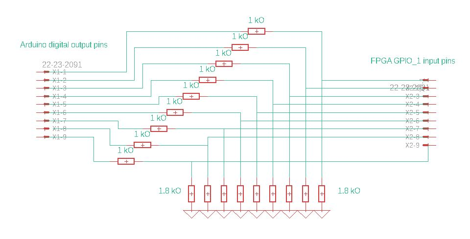
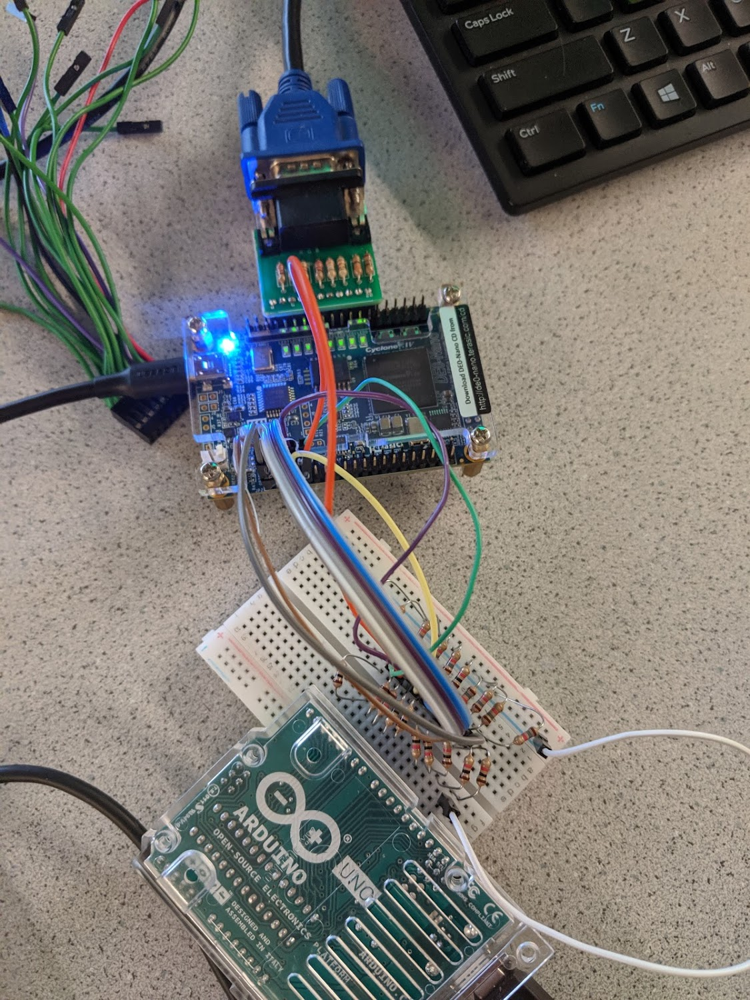
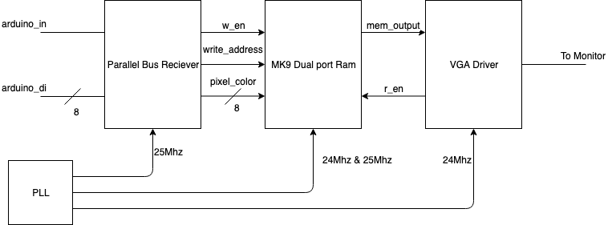

# Lab 3
## Monday 11/4/2019

In this lab, we used a parallel interface to connect the arduino to a DE0-NANO FPGA board in order to display an arduino input on the monitor using a VGA connection between the monitor and the FPGA. Below includes the connection between the base station's arduino and the FPGA, and the drawing on the monitor based on input from arduino to FPGA. 

***1. Connection between Base Station's Arduino and FPGA***

In order to connect the arduino to the FPGA, we knew that we needed to create a voltage divider using resistances. The arduino outputs a 5V signal on high and the FPGA digital logic occurs at 3.3V. If we directly connected the arduino pins to the FPGA GPIO_1 pins, we would fry the FPGA. We knew that we needed 9 connections ( 8 for input color from arduino, 1 for the clock signal). We obtained nine 1.8 kilo Ohm resistors and nine 1 kilo Ohm resistors, and created a voltage divider on each output pin of the arduino. Attached below is a schematic for the voltage divider and the picture of the voltage divider.

<p align="center">
  
  <br>
  <a>Voltage Divider Schematic</a>
</p>

We opted to use a parallel bus to the FPGA due to multiple factors, the main factor being developement time for the FPGA. Traditional serial buses, such as SPI and I2C, would have to be implemented with code from other sources which would take time to understand and interface with the code. Making our own IP core would take longer than this class runs. In contrast, a parallel data bus allows a quick startup time for the FPGA, allowing for longer amounts of time to debug and test with the arduino. The configuration is shown below:

<p align="center">
  
  <br>
  <a>Picture of FPGA to microcontroller interface</a>
</p>

***3. The FPGA Interface***

In order to obtain this connection, we first downloaded the Lab 4 Template from the course website. This code included the DE0-NANO.v, IMAGE_PROCESSOR.v, Dual_Port_RAM_M9K.v, and the VGA_DRIVER.v. From this base code, the DE0-NANO.v code was the top level module which instantiated IMAGE_PROCESSOR.v, Dual_Port_RAM_M9K.v, and VGA_DRIVER.v. After downloading this, we focused on instantiating the clock using the pll tool from IP Catalog.

To do this, we went to *Tools>IP Catalog>Library>Basic Functions>Clocks; PLLs; and Resets>PLL* 
This opened a setup window, where we set our input clock (inclk0) to 50 MHz, and instantiated c0_sig, c1_sig, and c2_sig, three clocks, c0 had a 24 MHz frequency, c1 had a 25 MHz frequency, and c2 had a 50 MHz frequency. We then instantiated the module in our DE0-NANO.v code and replaced all CLOCK_50 modules with c2_sig and all 25 MHz clocks with c1_sig. Running this function

A general block diagram of the FPGA code for this lab is shown below:
<p align="center">
  
  <br>
  <a>FGPA code block diagram</a>
</p>

To create the parallel bus reciever, we first created an always block that would toggle an update flag, this would then, on the next clock cycle, cause the parallel bus reciever to begin writing the input color into memory. This was done with a synchronous always block on the 25Mhz clock. These blocks are shown below:

```verliog
wire 			arduino_in; //Incoming clock signal
assign arduino_in = GPIO_1_D[33];

wire [7:0] arduino_di;  //Incoming data line                           
assign arduino_di = GPIO_1_D[31:24];

reg             update;

always @ (arduino_in) begin
	if (arduino_in) begin //Input from arduino clock
		update = 1'b1;
	end
end

always @ (posedge c2_sig) begin
	if (update) begin
		pixel_data_RGB332 <= arduino_di[7:0]; //Update from Arduino
		W_EN <= 1'b1;
		if (X_ADDR > 480) //Is the index outside of the left bound?
			begin
				Y_ADDR <= Y_ADDR + 1;
				X_ADDR <= 0;
			end
		else begin //If not keep on moving left to right
				Y_ADDR <= Y_ADDR;
				X_ADDR <= X_ADDR + 1;
			end
	end else begin //Update flag is low, reset the addresses
		X_ADDR <= 0;
		Y_ADDR <= 0;
		W_EN   <= 0; 
	end
end
```
In the synchronous always block above, the FPGA checks to see if the update flag is high. If the flag is high, it begins to update the values of the MK9 dual port ram with the color input. It then walks all the way through each pixel in the MK9 ram, updating their values from left to right, top to bottom. Once the memory overflows, it stops the updating, reseting X_ADDR, Y_ADDR, and the W_EN flag. This allows for every single pixel on the screen to be updated via a single byte fro the arduino. The only requirement of this is that the parallel bus maintain its value for the duration of the update, which is verified by the arduino code in the next section. 

***3. Using the Arduino to transmit data to the FPGA***

To be able to transmit data to the FPGA over our our parallel bus, we wrote a quick test script that contained a parallel bus write function shown below.

```cpp
/* Atomic write to the parallel bus */
void parallelWrite(int n){
  noInterrupts(); //Disable system interrupts
  
  //Write the int to the serial bus
  int i;
  for(i = 0; i < 7; i++){
    digitalWrite(i, (n >> i) & 1 ? HIGH:LOW)
  }
  
  digitalWrite(pCLK, HIGH); //Data Valid High
  delay(50);
  digitalWrite(pCLK, LOW);  //Data Valid Low
  
  interrupts(); //Enable system interrupts
}
```
The above function would be called whenever a serial transmission was recieved from the serial monitor. The function can take in any value int, but will only output the least significant 7 bits if the number. The function itself is atomic as if it were interrupted or yielded to another process, one of the GPIO pins could be modified, and casue the 7bits to not be transmitted correctly. This will come into play when the radio recieves packets, which will most likely trigger an ISR. The core functionality of the function is the loop that iterates from the 0th bit of the int to the 6th bit, writing to the GPIO bus with each sucessive loop. This was tested by using the Oscilliscope to measure the length of the clock pulse, as well as the Multimeter to check the values of each bit in the bus.

***4. Final Results***

In the end, we were able to change the display color on the monitor via the serial terminal of the Arduino. This code will eventually be able to be used to display to the incoming packets from the radio module. The robustness of the arduino code combined with the easy to use FPGA interface will allow to quickly develop extra features as we get closer and closer to the competition. Below is a demo video of the system:
