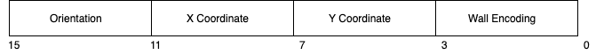
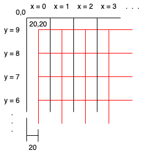

<h1 align="center">Lab 4: Radio Communication and Full Robot Integration</h1>


# Objectives 

   The objective of this lab is to use the Nordic nRF24L01+ transceivers and the corresponding Arduino RF24 library to get the robot and the video controller to communicate with each other. Also, full robotic integration is expected of this lab.
   
   The objective of this milestone is for the robot to update the base station's display in a basic way, communicate information with the base station, and detect other robots and act upon that information.
  
  **Additional Materials:**
  - Nordic nRF24L01+ transceivers
  - Arduino RF24 library
  - existing robot
     - existing robot contains hardware to detect other robots from previous milestone
  
## Process: Full Robotic Integration

### 1. Motor Control
For motor contro, we used two Parallax servos attached to the robot. We would attach the Arduino pin to the Servo in `setup()` and set values to it with 90 being stop. For example, our forward function set the servos to `servoR.write(70)` and `servoL.write(110)`. The various functions to make the robot go forward and turn are apparent in our various videos. 

### 2. FFT: Tone Sensing
In order to detect a specific frequency, we need to use Arduino's FFT library. One of the example sketches of the Arduino library is the fft_adc_serial.ino sketch. The FFT function works by using the analog to digital converter, determining the frequency of the signal, and placing the signal magnitude into the corresponding bin. We define the type of output and the number of bins using the following code. The code below uses the logarithmic output and defines the number of bins to 128 bins.
```c
#define LOG_OUT 1
#define FFT_N 128
```

For the Arduino, the ADC sampling rate is 9615 Hz, and we divide the sampling rate by the number of bins to determine which bin we put our signal in. Since we have 128 bins, we divide 9615 by 128 to see the frequency size of each bin. The frequency of 950 Hz fits in the 12th bin, since the 12th bin holds frequencies between 901.41 Hz and 976.52 Hz. 

In the loop code, we take the fft_input and set all the odd valued indexes to 0. This is because this code puts real valued numbers in the even bins and imaginary numbers in the odd bins. We only want the magnitude of the real values, so we set the imaginary terms to 0. 
```c
for( int i = 0; i < 128, i+= 2 )
{
  /*code before fft_input code*/
  fft_input[i] = k;
  fft_inputi+1] = 0;
}
```
After that, we set a conditional to check whether there is a tone in the 950 Hz range. We do this by setting a conditional on the fft_output whether it reaches a value of 80 and has a 3 difference from the neighboring bins, indicating a tone in that frequency range.
```c
if( fft_log_out[12] - fft_log_out[13] > 3 && fft_log_out[12] - fft_log_out[11] > 3 && fft_log_out[12] > 80 ){
  digitalWrite( 3, HIGH );
}
```
If those conditions are met, we know that there is a strong signal in the range of 901 and 976 Hz, so we set pin 3 to HIGH, thus indicating we have a tone of frequency 950 Hz. 
### 3. Robot Starts when it detects 950 Hz

To get our robot to detect the 950 Hz signal, we need to amplify our signal using the op amp circuit pictured below
<p align="center">
	
        <br>
	<a>Microphone Circuit</a>
</p>

The schematic shown below is the circuit used for the microphone. Initally, the signal is passed through an RC with a very low frequency cutoff, acting as an ac coupler. After the RC filter, there is a resistor divider that biases the circuit at 2.5V. This then passes into an op amp in a non-inverting configuration with a gain of 10 with a DC offset of 2.5V. 

<p align="center">
	
        <br>
	<a>Microphone Circuit</a>
</p>

This Circuit was placed on a protoboard on our robot, pictured below.
<p align="center">
	
	<br>
	<a>Microphone Circuit on Robot</a>
</p>

### 4. Override Button
For testing in lab and in case the robot does not start with the 950 Hz tone, we attached an override button.


We connected the button to the 5V and attached to digital pin 3. It would pass 1 when pressed and 0 when it's not. To implement this in our code, we decided to create a global variable `can_start` which is initialized to `false`. 

```c
while (can_start == false)
  {
    goStop();
    can_start = digitalRead(push_button) || microphone_detect();;
  }
```

This while loop is written in the loop function, and it will be stuck in this while loop until `can_start` is true, which is when the button is pressed or 950 Hz is detected. When the while loop is excited, the code will never enter this while loop again and will continue on with the rest of the navigation code. 

### 5. Line Sensing and Following

We used three line sensors in front of the robot. They were spread far enough apart that the distance between two sensors is about the width of the line. To make it easier to find the threshold, we decided to average a sample in the setup function.

```c
while (i < 50)
{
  temp += analogRead(A1);
  i++;
}
threshold = temp / 50 + 350;
```

This way, we wouldn't need to update the threshold value for slightly different conditions.

To follow the line, we used the fact at a given time, both the right and left line sensors could not be on the line simultaneously. We deduced that if the left sensor is on the line but the right is not, the robot must veer right slightly, and vice versa.

```c
if (isOn(C) && !isOn(L) && !isOn(R))
    goFor();
  else if (isOn(L) && !isOn(R))
  {
    slightLeft();
  }
  else if (!isOn(L) && isOn(R))
  {
    slightRight();
  }
```
When it is at an intersection, all three line sensors must sense white, so we implemented turning functions that would only be called on intersections. Because using time delays were very inaccurate, we decided to call the turn function and continue to line following when the sensors detected another line.

```c
void turnLeft()
{
  goFor();
  delay(400);
  hardLeft();
  delay(700);
  R = getR();
  while (!isOn(R))
  {
    R = getR();
  }
  goStop();
}
```

### 6. Wall Sensing
To detect walls, we added short range IR sensors to the front and the sides of the robot. When testing the sensors with the Arduino, we were able to code a function that would convert the analog value to distance in centimeters. We then created a boolean function called `isWall(int distWall)` that would return a boolean value if the distance of a wall from the robot is less than the set threshold. 

```c
boolean isWall(int sensorDistance)
{
  if (sensorDistance < 20)
    return true;
  return false;
}
```

We used this boolean function to check where the walls are around the robot. We only check the location of walls at intersections since we can only turn to avoid walls on intersections.

In the navigation code, we use a matrix of boolean values the size of the maze to represent visited nodes and a stack array. Whenever the node is visited, that node is added to the stack and the boolean value of that coordinate in visited is set to true . The nodes in the stack then get popped when the robot enters backtrack mode and travels to the popped nodes to go back to the origin. To deal with unexplorable nodes, we would check whether the stack is empty rather than checking if all the elements in the visited array are set to true. The stack would only be empty when the robot has finished backtracking and is back at the origin.

```c
//stack is empty when it reaches (0, 1) so it must still go forward to (0, 0) to finish
while (stack.isEmpty())
{
      
  C = getC();
  L = getL();
  R = getR();
  if (isOn(C) && !isOn(L) && !isOn(R))
    goFor();
  else if (isOn(L) && !isOn(R))
  {
    slightLeft();
  }
  else if (!isOn(L) && isOn(R))
  {
    slightRight();
  }
  if (isOn(C) && isOn(R) && isOn(L))
  {
    radio_transmitter();
    while (1)
    {
      goStop();
      digitalWrite(finishPin, HIGH);
    }
  }
}
```

### 7. Robot Sensing and Avoidance

[Go here for Robot Sensing and Avoidance from Milestone 4 Portion](#process-acting-upon-robot-detection)

### 8. Navigation Algorithm, Finish LED
We decided that DFS was the best way to explore the maze efficiently. To implement DFS, we first created a boolean array `visited_nodes`, a stack array 'stack', and a boolean value 'backtrack'. Our prioritization was North, East, South, and West. The robot would swap between line following functions and DFS; line following is only used when traversing a line and DFS is called at intersections.

When the Robot enters DFS, it first marks the `current_node` as visited in the array. It then checks the `current_dir` and decides an action from there. Regardless of the `current_dir`, the robot will first try to continue heading in the forward direction. If there is a wall or robot in its path, it will then turn to the next available node, in priority order of North, East, South, and West. If the robot has to turn backward, it will exit DFS and perform no action except changing `back_track` to true. Then, the code will exit back to loop but will immediately jump to the code when all line sensors are active (the process through DFS is very fast and has virtually no delay so the robot is still on the intersection). However, now that `back_track` is true, it will jump to the backtrack() function.

In backtrack, it will peek at the node on top of the stack and declare it as `next_node`. Depending on the robot's direction, it will compare the relative direction of the next node to the current node. All nodes in the stack are one tile away from each other, and the robot will decide which way to turn to reach that next tile. We then turn `backtrack = false` when it makes that decision. We do this because there is a possibility that in backtracking, the robot can continue DFS to unvisited nodes, but if the surrounding nodes are already visited, DFS will turn `backtrack = true` again and backtrack will continue. 

### 9. FPGA/Base Station

### 10. Wireless Communication

To send information from the robot to the base station, we need to use a radio transceiver on pins 9-13 and GND pins of Arduino. We first must interpret the data from the robot. This is done by creating a two bye packet. We created a separate function which is called at every intersection called radio_transmitter().

```c
void radio_transmitter()
{
  bool wallC = isWall(distC);
  bool wallL = isWall(distL);
  bool wallR = isWall(distR);
  
  int wall_value = get_wall_cases(wallC, wallL, wallR );
  radio.stopListening();
  bool ok;
  int data_packet = (current_dir<<12) | (current_node.x<<8) | (current_node.y<<4) | wall_value;
  ok = radio.write( &data_packet, 2 * sizeof( byte ) );
  radio.setAutoAck( true );
  radio.startListening();
}
```
We created a helper function called get_wall_cases, which is a series of conditional statements which return a value for wall detection. These values range from 0 to 7. We define integer values to wall_value which are then placed in data_packet. 

```c
int get_wall_cases( bool wallC, bool wallL, bool wallR )
{
  if( wallL && !wallC && !wallR )
    return 1;
  else if( !wallL && !wallC && wallR )
    return 2;
  else if( wallL && !wallC && wallR )
    return 3;
  else if( !wallL && wallC && !wallR )
    return 4;
  else if( wallL && wallC && !wallR )
    return 5;
  else if( !wallL && wallC && wallR )
    return 6;
  else if( wallL && wallC && wallR )
    return 7;
  else
    return 0;
}
```
This piece of code interprets wall sensor data and transmits two bytes from the robot to the base station.


## Basestation integration

### 1. FPGA wall display

Displaying the maze of the FPGA requires the creation of two main IP blocks, a receiver that will take in information from the basestation Arduino as well as a block that will interpret that information and then write it to the video memory so it can be displayed. 

The connection between the Arduino and FPGA was handled via a parallel bus. The bus was 9 bits wide, with one bit functioning as the clock for the connection. To communicate a byte with the FPGA, first one would have to drive the data lines to the desired value, the clock and hold while the FPGA wrote to memory. This was implemented on the FPGA with a synchronizer shown below

```verilog
  assign mcuVLD = GPIO_1_D[33];
  assign mcuDINw = {GPIO_1_D[25], GPIO_1_D[26], GPIO_1_D[27], GPIO_1_D[28], GPIO_1_D[29], GPIO_1_D[30], GPIO_1_D[31], GPIO_1_D[32]};
  assign writeVALID = (~mcuVLDedge && mcuVLD);

  always @ ( posedge c2_sig)  begin
    if( ~KEY[0] ) mcuVLDedge <= 1'b0;
    else mcuVLDedge <= mcuVLD;
  end

  always @ ( posedge c2_sig ) begin
    if (~KEY[0] ) mcuDIN <= 0;
    else if (mcuVLD) mcuDIN <= mcuDINw;
    else mcuDIN <= mcuDIN;
  end
```

Once the information was received on the FPGA, the data needed to be processed. The format of the packet from the Arduino is show in the figure below.



The first cycle after the arduino drives the clock high, the FPGA latches the X, Y, and wall position from the arduino. The X and Y values are offset and the multiplied to get the proper pixel orientation on the sceen. A diagram of our gridlines are shown below. 



The background for the display is hard coded into the FPGA, only allowing a memory write on addresses that do not fall onto the grid. This is to ensure that the grid is persistant on reset and cannot be over written by a write to memory. This also gave an easy armature to draw the walls about. The code for drawing the background grid is shown below.

```verilog
always @ (c1_sig) begin
	if (VGA_READ_MEM_EN) begin
		if (VGA_PIXEL_X == 40 || VGA_PIXEL_X == 80 || VGA_PIXEL_X == 120 || VGA_PIXEL_X == 160 || VGA_PIXEL_X == 200 || VGA_PIXEL_X == 240 || VGA_PIXEL_X == 280 || VGA_PIXEL_X == 320 || VGA_PIXEL_X == 360) begin
			displayColor <= 8'hff;
		end else if (VGA_PIXEL_Y == 40 || VGA_PIXEL_Y == 80 || VGA_PIXEL_Y == 120 || VGA_PIXEL_Y == 160 || VGA_PIXEL_Y == 200 || VGA_PIXEL_Y == 240 || VGA_PIXEL_Y == 280 || VGA_PIXEL_Y == 320 || VGA_PIXEL_Y == 360) begin
			displayColor <= 8'hff;
		end else begin
			displayColor <= MEM_OUTPUT;
		end
	end else begin
		displayColor <= 8'hff;
	end
end
```

Once these values are latched, the FPGA begins iterating over the pixels that are contained in the block surrounding the robots position left to right, top to bottom. Depending on the value of the wall passed into the FPGA, the FGPA only writes memory on the pixel where the wall is intended to be positioned. This is done by only driving the W_EN wire to the MK9 memory high once the X_ADDR and Y_ADDR are in the correct loction in the sweep. Once the FPGA finishes its iteration of the entire block, it raises a WRITE_DONE flag so that the unit knows to stop and wait for the next incoming byte. This unit is shown in the verilog code below.

```verilog

///// Decode the incoming bit /////
always @ (posedge c2_sig) begin
	if (~KEY[0]) // On rest
		begin
			X_ADDR <= 0;
			Y_ADDR <= 0;
			W_DONE <= 1'b0; // Not done (haven't started)
		end
	else if (writeVALID) // Latch values on rising clock edge
		begin
			X_ADDR <=  20 + (mcuDIN[5:3] * 40);
			Y_ADDR <=  20 + (mcuDIN[2:0] * 40);
			W_DONE <= 1'b0; //Not done
		end
	else if (~W_DONE && mcuVLD) //Are we done yet?
		begin
		  // Conditional ensures that we are writing in the correct grid offset
			if (X_ADDR >= 20 + 40 * mcuDIN[5:3] && X_ADDR <= 20 + 40 * (mcuDIN[5:3] + 1))
				begin
					case(mcuDIN[7:6])
						2'b00: begin //TOP WALL
									pixel_data_RGB332 <= RED;
									W_EN <= (Y_ADDR == 20 + (mcuDIN[2:0] * 40)) ? 1:0;
								 end
						2'b01: begin //RIGHT WALL
									pixel_data_RGB332 <= RED;
									W_EN <= (X_ADDR == 20 + ((mcuDIN[5:3] + 1) * 40)) ? 1:0;
								 end
						2'b10: begin // BOTTOM WALL
									pixel_data_RGB332 <= RED;
									W_EN <= (Y_ADDR == 20 + ((mcuDIN[2:0] + 1) * 40)) ? 1:0;
								 end
						2'b11: begin // LEFT WALL
									pixel_data_RGB332 <= RED;
									W_EN <= (X_ADDR == 20 + (mcuDIN[5:3] * 40)) ? 1:0;
								 end
					endcase
					X_ADDR <= X_ADDR + 1; //Pixel by pixel write to the dual port ram
					Y_ADDR <= Y_ADDR;
					W_DONE <= 1'b0;
				 end
			else if (Y_ADDR < 20 + ((mcuDIN[2:0] + 1) * 40) && Y_ADDR >= 20 + 40 * mcuDIN[2:0])
				begin
					Y_ADDR<= Y_ADDR + 1;				// Increment Y
					X_ADDR <= 20 + (mcuDIN[5:3] * 40);  // Reset X
					W_DONE <= 1'b0;
					W_EN <= 1'b0;
				end
			else 
				begin
					X_ADDR <= 0;
					Y_ADDR <= 0;
					W_DONE <= 1'b1; //Finally we are done
					W_EN <= 1'b0;
					
				end
		end else begin
			X_ADDR <= 0;
			Y_ADDR <= 0;
			W_DONE <= 1'b1;
			W_EN <= 1'b0;
		end
end


```

### 2. Base Station Arduino Code

The other half of the base station, the Arduino, handles radio communication with the robots as well as the majority of the data processing. The arduino first is connected to the FPGA using a parallel communication bus which uses nine GPIO pins. Below is the code used in the main lopp of the arduino to interface with the radio module.

```c
    // if there is data ready
    if ( radio.available() )
    {
      // Dump the payloads until we've gotten everything
      int data_received;
      bool done = false;
      while (!done)
      {
        // Fetch the payload, and see if this was the last one.        
        done = radio.read( &data_received, 2 * sizeof( byte ) );
        Data_Interpreter(data_received);
      }
      
        // First, stop listening so we can tal
        // Now, resume listening so we catch the next packets.
        radio.startListening();
      }
```
We constantly poll the radio, checking to see if we are receiving a transmission from the robot has come. If it has, we wait for the transmission to complete then we pass the received data into our data decoder so we know what data to send to the FPGA. The data decoder first breaks down the two byte number into four, four bit numbers that are then decoded by four case statements which return -1 if the values are invalid. If either of the values return invalid, the transmit process exits and the arduino goes back to polling the radio. The X and Y coordinates, bits [11:4] are passed directly into the FPGA packet so that the correct block position can be displayed. Bits [3:0], which contain the wall positions relative to the robot is first translated and stored into an array of bools. Finally, the walls are rotated by a rotation matrix implemented as a case statement so that the wall positions are in the reference fram of the robot. The code for this is shown below.

```c
 /* Matrix rotation operation to put robot reference frame in base station reference fram */
    switch(ori){
          case 0: buff[0] = wall[0]; buff[1] = wall[1]; buff[2] = wall[2]; buff[3] = wall[3]; break;
          case 1: buff[0] = wall[3]; buff[1] = wall[0]; buff[2] = wall[1]; buff[3] = wall[2]; break;
          case 2: buff[0] = wall[2]; buff[1] = wall[3]; buff[2] = wall[0]; buff[3] = wall[1]; break;
          case 3: buff[0] = wall[1]; buff[1] = wall[2]; buff[2] = wall[3]; buff[3] = wall[0]; break;
    }
```

After the rotation, the arduino is ready to pass the wall values onto the FPGA so they can be displayed. This is handled by looping over the buff[] array, and if there is a wall there, a packet is formed and sent to the FPGA so that wall can be drawn. Each wall is drawn one by one based off the way that the FPGA has been implemented. The code for the transmitting is shown below.

```c
  int j, sendByte;
  for (j = 0; j < 4; j++){
      if (buff[j] == 1){
        sendByte = (j << 6) + ((xSend) << 3) + (8 - ySend); // Format packet for FPGA
        //Serial.print(sendByte); //For debugging
        parallelTransmit(sendByte);
      }
  }
```

Within the parallel write function, we write to each of the GPIO pins on the arduino by shifting the bits of the input byte. Once this is done we clock the FPGA high for 10ms, then low then high again for another 10ms. The second write funciton was added after we noticed that the FPGA would occasionally miss the clock due to poor input signal integrity of the resistor divider used to bring the 3.3V of the FPGA and the 5V of the arduino. The parallel write funciton is shown below.

```c
    sendByte = (0x00FF & sendByte); // Assert 16 bit number
    digitalWrite( CLK, LOW);        // Assert Clock Low

    /* Write the GPIO using psuedo shift register, Keeping CLK Low */
      digitalWrite( BIT0, (sendByte >> 0 & 0x0001) ? HIGH:LOW);
      digitalWrite( BIT1, (sendByte >> 1 & 0x0001) ? HIGH:LOW);
      digitalWrite( BIT2, (sendByte >> 2 & 0x0001) ? HIGH:LOW);
      digitalWrite( BIT3, (sendByte >> 3 & 0x0001) ? HIGH:LOW);
      digitalWrite( BIT4, (sendByte >> 4 & 0x0001) ? HIGH:LOW);
      digitalWrite( BIT5, (sendByte >> 5 & 0x0001) ? HIGH:LOW);
      digitalWrite( BIT6, (sendByte >> 6 & 0x0001) ? HIGH:LOW);
      digitalWrite( BIT7, (sendByte >> 7 & 0x0001) ? HIGH:LOW);

    /* CLock The FPGA */
      digitalWrite(CLK, HIGH);
      delay(10);
      digitalWrite(CLK, LOW); 
```
### 3. Complete Integration Maze Mapping Videos

<iframe width="560" height="315" src="https://www.youtube.com/watch?v=ZRnJ6TjiB80" frameborder="0" allow="accelerometer; autoplay; encrypted-media; gyroscope; picture-in-picture" allowfullscreen></iframe>

<iframe width="560" height="315" src="https://www.youtube.com/watch?v=FoZ5C8XUYHY" frameborder="0" allow="accelerometer; autoplay; encrypted-media; gyroscope; picture-in-picture" allowfullscreen></iframe>
